

  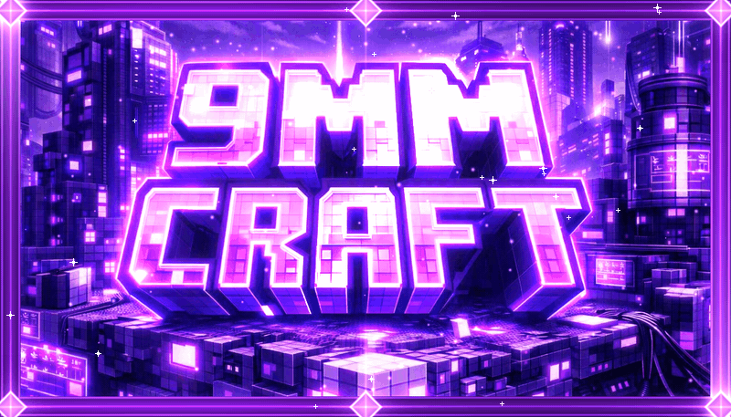

<h1 align="center">💜✨ Nine Craft ✨💜</h1>

  <b>⚙️ Tech &nbsp;•&nbsp; 🔮 Magic &nbsp;•&nbsp; ⚔️ RPG &nbsp;•&nbsp; 🌻 Cozy &nbsp;•&nbsp; 🍲 Food &nbsp;•&nbsp; ⚡ Power</b> 
  <i>504 mods. 40 quest chapters. 810+ hand-written quests. One giant world where every playstyle lives side by side.</i>

  
  
  
  
  

  <a href="https://www.curseforge.com/minecraft/modpacks/nine-craft"><b>📥 Download on CurseForge</b></a> &nbsp;·&nbsp;
  <a href="MODLIST.md"><b>📜 Mod List</b></a> &nbsp;·&nbsp;
  <a href="#-gallery"><b>🖼️ Gallery</b></a> &nbsp;·&nbsp;
  <a href="../../issues/new/choose"><b>🐛 Report a Bug</b></a>

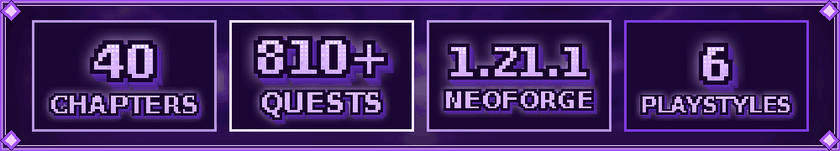

**Nine Craft** is a massive **kitchen-sink modpack for NeoForge 1.21.1** built around one idea: *you should never have to pick just one way to play.*

Build a roaring **Create** factory in the morning. Sling fireballs with **Iron's Spellbooks** at lunch. Run a cozy farm-to-table kitchen with **Farmer's Delight** in the afternoon. Take on a colossal **Cataclysm** boss before bed, then go home to a base you furnished piece by piece. **Do it all, in any order, at your own pace.**

Every major system is tied together by a **fully original quest book**, so you always know what to try next.

- 🟣 **504 hand-picked mods** covering tech, magic, RPG, building, farming, food and exploration
- 📖 **40 quest chapters / 810+ quests**, all written from scratch for Nine Craft
- 🎁 **Custom loot tables** (Common ➜ Uncommon ➜ Rare ➜ **Epic**) that reward you for crafting
- 🌄 **Shader-ready out of the box** with Iris plus Complementary Reimagined, Complementary Unbound and Sildur's Vibrant
- 🚀 **Performance-tuned** with Sodium, Lithium, ImmediatelyFast, Entity Culling, FastBoot and more
- 👥 **Built for friends** with FTB Teams, FTB Chunks claiming and shared quest progress

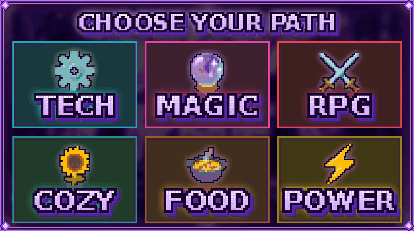

## 🖼️ Gallery

*All shots taken in Nine Craft with Complementary shaders.*

<table>
  <tr>
    <td>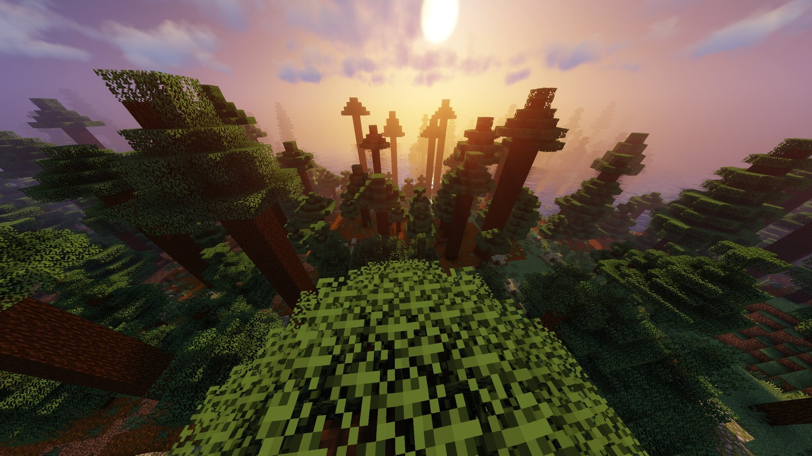</td>
    <td>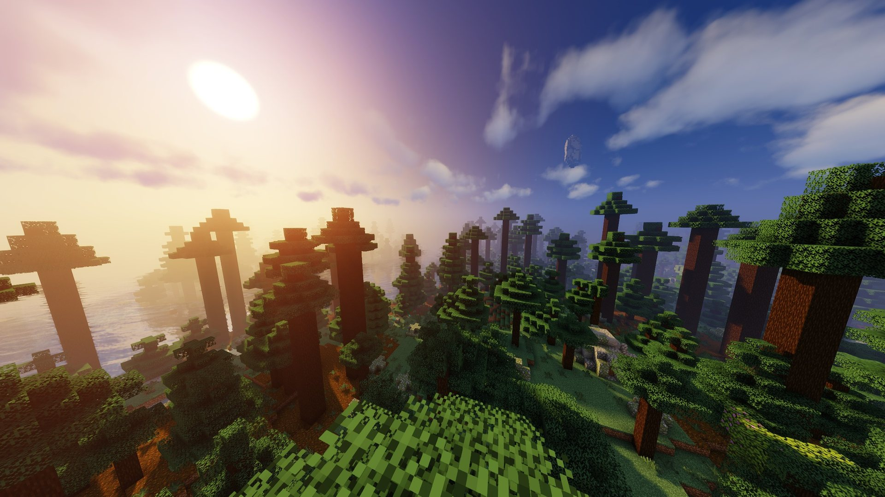</td>
    <td>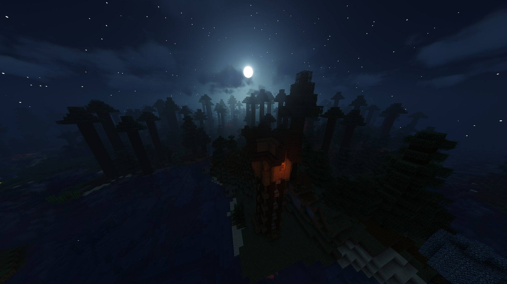</td>
  </tr>
  <tr>
    <td>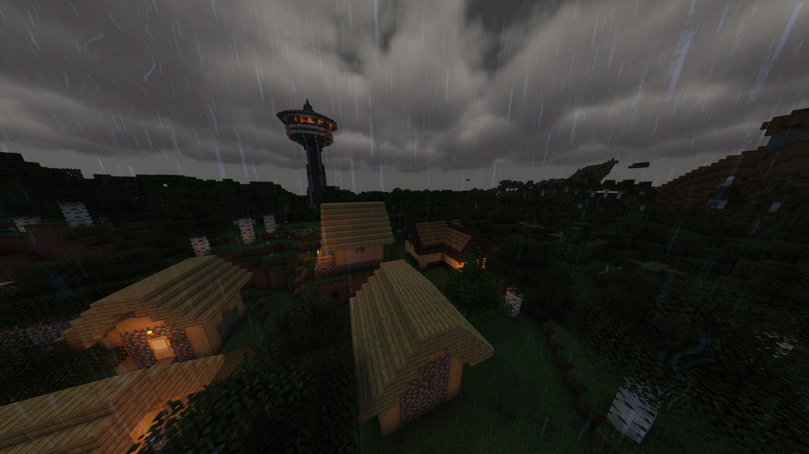</td>
    <td>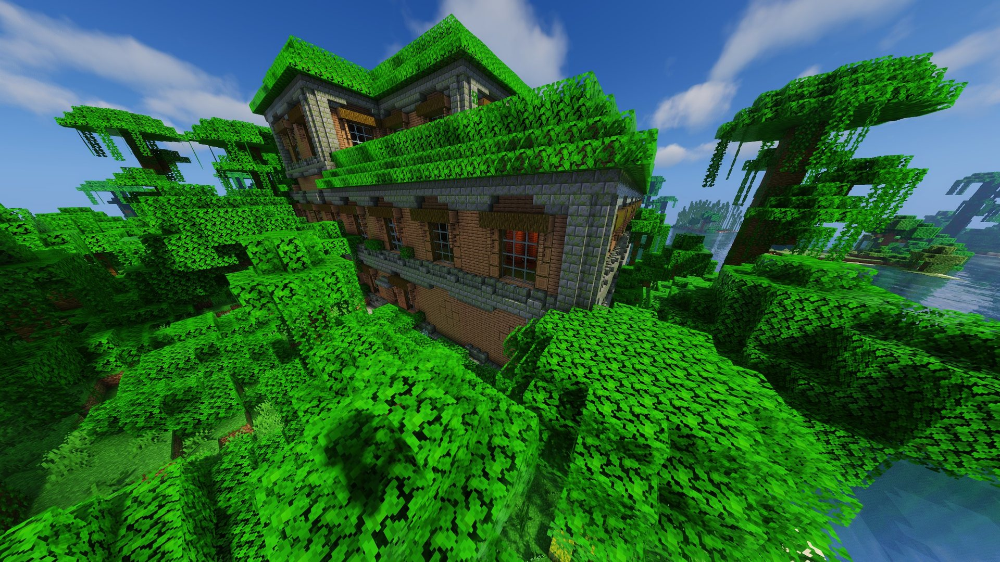</td>
    <td>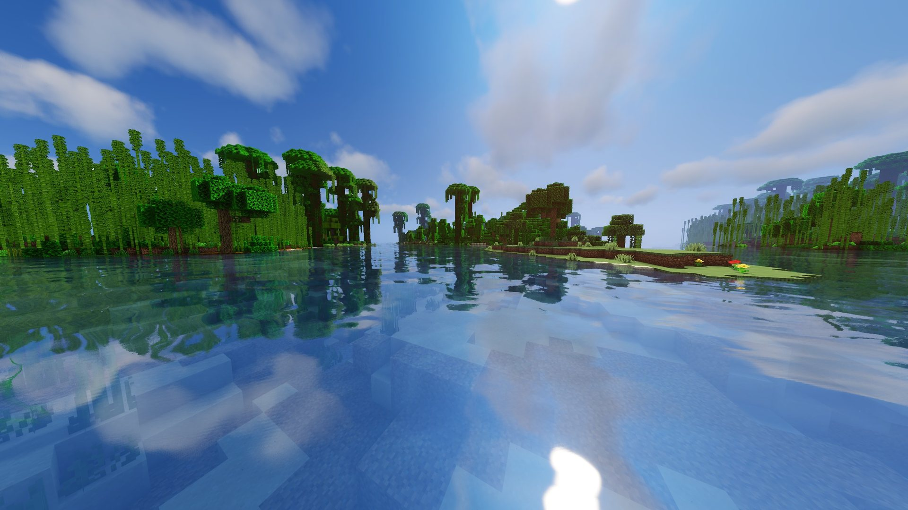</td>
  </tr>
  <tr>
    <td>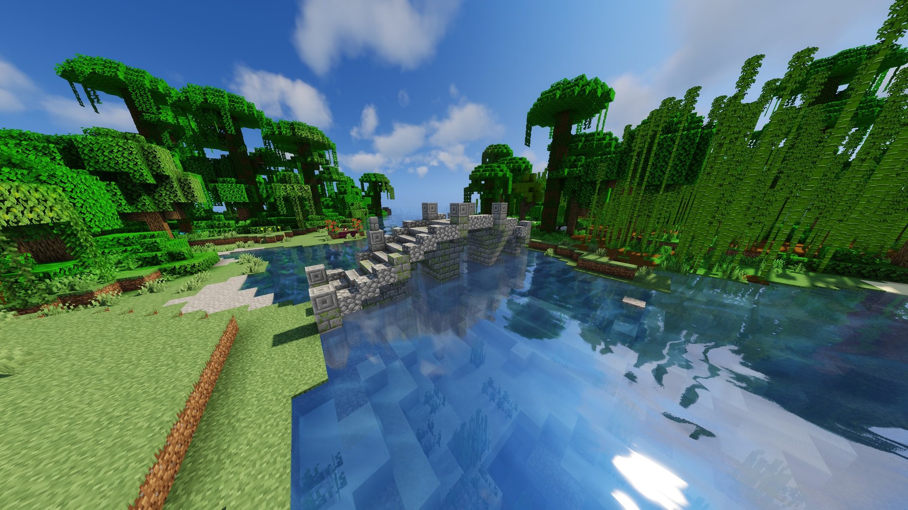</td>
    <td>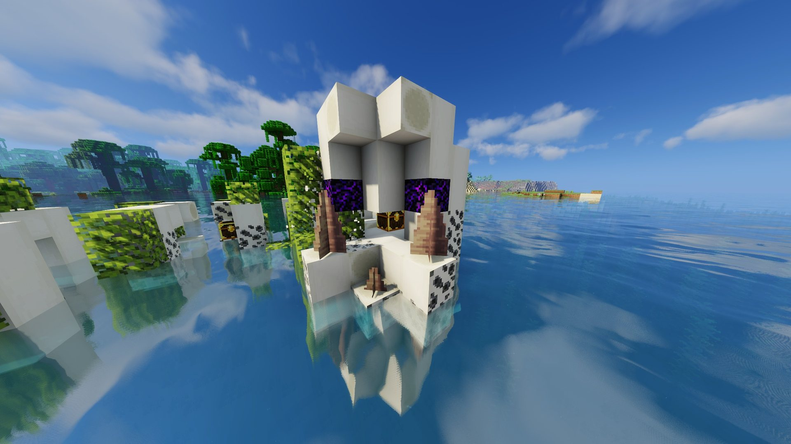</td>
    <td>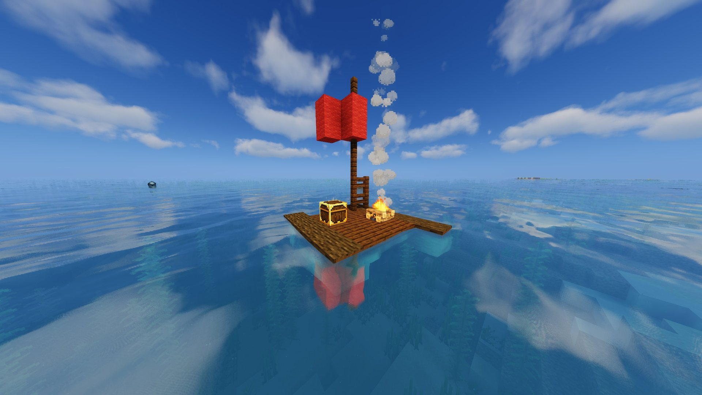</td>
  </tr>
</table>

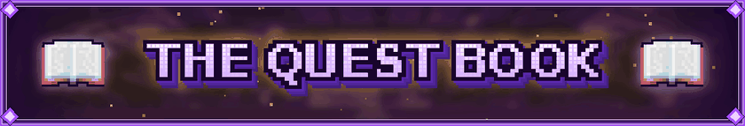

The heart of Nine Craft is its hand-crafted **FTB Quests** book: every quest, description, chapter layout and piece of chapter art was made from scratch for this pack. You can find it in [`overrides/config/ftbquests`](overrides/config/ftbquests).

- 📚 **40 chapters** and **~810 quests** covering nearly every major mod
- ⭐ **The Main Path** walks you through the whole game:
  - 🪓 Punch Some Trees ➜ ⛏️ First Pickaxe ➜ 🔥 Iron Age ➜ 💎 Diamonds!
  - 🌋 Welcome to the Nether ➜ 👁️ Eyes of Ender ➜ 🐉 Slay the Dragon ➜ 💀 Face the Wither
  - 🟪 Allthemodium ➜ 🟦 Vibranium ➜ 🟥 **Unobtainium** ➜ 🎮 Endgame Toys
- 🎨 **Custom purple pixel-art banners** for every chapter
- 🎁 **Rewards that feel good:**
  - 🧪 Mine, farm, loot or kill something? Earn **XP levels**
  - 🎲 Craft something? Roll the **Nine Craft loot tables**: 🟢 Common, 🔵 Uncommon, 🟣 Rare, 🟡 **Epic**
  - 📈 The deeper you go into a chapter, the **better the table**
  - 🧰 **~110 quests hand you the materials for your next step**

<b>🧭 All 40 chapters by section</b>

| Section | Chapters |
|---|---|
| ✦ **Start Here** | Welcome to Nine Craft, The Main Path |
| ⬜ **The Basics** | Spark of Power, Chests & Drawers, Gearing Up, Harvest & Hearth, Items on the Move |
| 🟩 **Resources & Farming** | Deep Metals, Mystical Agriculture, Productive Bees, Productive Trees, Hostile Neural Networks |
| 🟦 **Technology** | Create, Mekanism, Mekanism Generators, Oritech, Ender IO, Industrial Foregoing, Powah!, Extreme Reactors, Actually Additions, Just Dire Things, XyCraft, Integrated Dynamics, Compact Machines |
| 🟧 **Modern Industrialization** | Steam Age, Electric Age, Digital Age, Quantum Endgame |
| 🟨 **Storage & Logistics** | Applied Energistics, Refined Storage |
| 🟪 **Magic** | Ars Nouveau, Iron's Spellbooks, Occultism, Enchanting |
| 🟥 **Adventure & Combat** | Bounty Board, Cataclysm, The Bumblezone, Silent Gear, Artifacts & Relics |

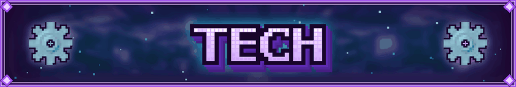

<i>Gears, pipes, machines and factories as far as the eye can see.</i>

- ⚙️ **Create**: spinning shafts, water wheels, presses, contraptions and gloriously over-engineered factories
- 🔩 **Mekanism** + Extras, Unleashed, More Machine, Weapons, Tools and the **Better Fusion Reactor**: ore multiplication, MekaSuits and a massive tech tree
- 🏭 **Modern Industrialization**: a four-chapter journey from ♨️ Steam Age to ⚡ Electric Age, ⌨️ Digital Age and ∞ **Quantum Endgame**
- 🛰️ **Oritech**, 🔥 **Industrial Foregoing**, 🏗️ **Immersive Engineering** and **PneumaticCraft: Repressurized**
- 🐉 **Draconic Evolution**: draconium, energy cores and some of the strongest gear in the game
- ✦ **Ender IO**, ◈ **Actually Additions**, ✹ **Just Dire Things**, ◇ **XyCraft**
- ⌬ **Integrated Dynamics** (+ Tunnels, Crafting, Terminals, Scripting), 🧰 **RFTools** and **XNet**
- 📦 **Compact Machines**: build an entire factory inside a single block

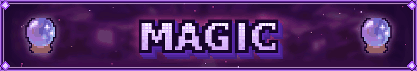

<i>Spells, rituals, spirits and enchantments for the arcane-minded.</i>

- 📘 **Iron's Spells 'n Spellbooks**: collect scrolls, build your spellbook and sling fire, ice, lightning and holy magic
- ✧ **Ars Nouveau**: *design your own spells* with glyphs, build rituals and summon familiars
- ☽ **Occultism**: summon spirits and demons to mine, craft, sort and work for you
- 🗝️ **Forbidden & Arcanus**, **EvilCraft** and **Reliquary**
- 🌟 **Apotheosis**, **Apothic Enchanting** & **Enchanting Infuser**: a deep, reworked enchanting system
- 🧙 **All the Wizard Gear** & **All the Arcanist Gear** for end-game casters

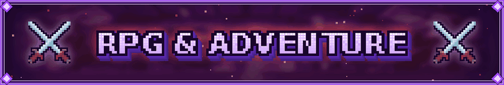

<i>Loot to find, gear to forge, monsters to hunt and bosses to topple.</i>

- ☠️ **L_Ender's Cataclysm** + **Cataclysm Dimensions**: epic boss fights with unique arenas and loot
- ⚔️ **Bounty Board** chapter: hunt everything from Zombies to the Elder Guardian and **The Warden**
- 🌀 **Gateways to Eternity**, 💎 **Apotheosis** affixed loot and gems
- 🛡️ **Silent Gear**, **Silent's Gems**, **Spartan Weaponry** & **Spartan Shields**
- 💍 **Artifacts** & **Relics**: Cloud in a Bottle, Running Shoes, Eternal Steak… and **Mimics!** 😱
- 🛡️ Armor progression: Iron ➜ Diamond ➜ Netherite ➜ **Allthemodium ➜ Vibranium ➜ Unobtainium**
- 🐝 **The Bumblezone**, 🏰 **YUNG's**, **Repurposed Structures**, **Lootr** and **BetterEnd**

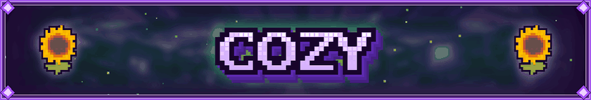

<i>Slow down, build something pretty and enjoy your world.</i>

- 🛋️ Decorate with **MrCrayfish's Furniture: Refurbished**, **Handcrafted**, **Macaw's**, **Chipped**, **Rechiseled** and **Supplementaries**
- 🐝 **Productive Bees**, 🌳 **Productive Trees**, 🪴 **Botany Pots** and 🎣 **Aquaculture 2**
- 🧑‍🌾 **Easy Villagers**, **Guard Villagers** & **Villager Names**
- 🛏️ **Comforts**, **Fancy Beds** & **Plushie Buddies**
- 🎒 **Sophisticated Backpacks & Storage**, **Functional Storage** and **Tom's Storage**
- 🗺️ **Waystones**, **JourneyMap** and **Nature's Compass**
- ✨ **Fresh Animations**, **3D Skin Layers**, **Sound Physics Remastered** and **Connected Glass**

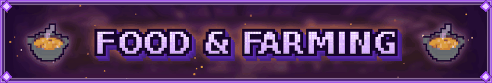

<i>A full kitchen, a full pantry and a full belly.</i>

- 🍳 **Farmer's Delight** + **Extended**: cooking pots, stoves, cutting boards and hearty meals
- 🍅 **Pam's HarvestCraft 2** (Crops, Trees, Food Extended & Fantasy)
- 🧑‍🍳 Delight add-ons: Aquaculture Delight, Occult Delight, Ars Nouveau's Flavors & Delight, Chef's Delight
- 🌾 **Mystical Agriculture** (+ Agradditions): grow your resources
- 🍎 **Iron Apples**, **AppleSkin** and the **Harvest & Hearth** quest chapter

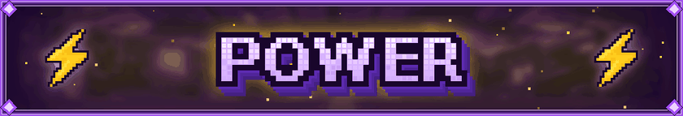

<i>From your first flickering generator to a star in a box.</i>

- ⚡ **Generator Galore** and the **Spark of Power** chapter
- 🔥 **Powah!**, ☢️ **Mekanism Generators** (Fission & Fusion) and 🟢 **Extreme Reactors**
- 🌐 **Flux Networks** + **Flux Overdrive** for wireless power
- ☀️ **Modern Industrialization** + **Solar Industrialization**, 🔋 **RFTools Power** and **Draconic energy cores**

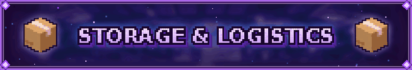

- ◈ **Applied Energistics 2** + ExtendedAE, MEGA Cells, AE2 Things, Applied Mekanistics and Wireless Terminals
- ▣ **Refined Storage** + Cable Tiers and Requestify
- ➜ **LaserIO**, **Modular Routers**, **Pipez**, **Ender Storage** and **Pylons**
- 🧠 **Hostile Neural Networks**
- 🪄 Quality of life: **JEI**, **Jade**, **Inventory Sorter**, **Mouse Tweaks**, **FTB Ultimine**, **Carry On**, **Trash Cans**

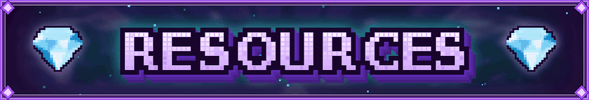

- 💎 **All The Ores** + **Allthemodium**: Allthemodium, Vibranium and Unobtainium tiers
- 🧱 **AllTheCompressed** and **Cobblegen Galore**
- 🌍 TerraBlender biomes, YUNG's Better Caves & Cave Biomes, Better Villages, Sky Villages, Stoneholm and BetterEnd: New Dawn
- ⛏️ Void miners, Additional Enchanted Miner and the Mekanism Digital Miner

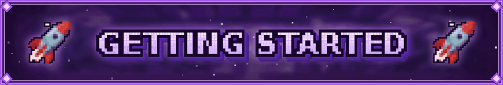

### 🎮 Playing

1. 📥 Install **Nine Craft** from [CurseForge](https://www.curseforge.com/minecraft/modpacks/nine-craft) with the CurseForge app
2. 🧠 Give Minecraft **at least 9–10 GB of RAM** (CurseForge ➜ Settings ➜ Minecraft ➜ Java Settings ➜ Allocated Memory)
3. 🌄 For the gallery look, press **O** in-game ➜ **Shader Packs** ➜ pick **Complementary Reimagined**, **Complementary Unbound** or **Sildur's Vibrant**
4. 🌍 Create a world, open your **quest book**, read **Welcome to Nine Craft** and follow **The Main Path** ⭐

### 🖥️ Running a server

Nine Craft works great in multiplayer with FTB Teams, FTB Chunks land claiming, FTB Essentials and FTB Backups built in. When a server pack is posted on the CurseForge **Files** tab, use it, and give the server at least as much RAM as the client (9–10 GB).

  

## 📁 What's in this repository

| Path | What it is |
|---|---|
| [`manifest.json`](manifest.json) | CurseForge pack manifest: Minecraft/NeoForge versions and every mod file the pack installs |
| [`modlist.html`](modlist.html) / [`MODLIST.md`](MODLIST.md) | The full list of 504 mods with links to each project |
| [`overrides/config/ftbquests/`](overrides/config/ftbquests) | The Nine Craft quest book: 40 chapters, loot tables and English text |
| [`overrides/kubejs/assets/ninecraft/`](overrides/kubejs/assets/ninecraft) | Chapter title art and quest book images |
| [`assets/branding/`](assets/branding) | Logo, banners and dividers used on CurseForge and here |
| [`assets/screenshots/`](assets/screenshots) | Shader screenshots for the gallery |

> **No mod jars are stored here.** The manifest only references mods; CurseForge downloads each one from its author's official page.

### ✏️ Editing the quest book

1. Copy `overrides/config` and `overrides/kubejs` into your Nine Craft instance folder.
2. In-game, open the quest book and turn on **edit mode** (the pencil button).
3. Quest text lives in `config/ftbquests/quests/lang/en_us/`, so it's easy to translate or tweak.

Found a bug, a quest showing the wrong item, or have an idea for a new chapter? 💡 [Open an issue](../../issues/new/choose) or leave a comment on [CurseForge](https://www.curseforge.com/minecraft/modpacks/nine-craft). See [CONTRIBUTING.md](CONTRIBUTING.md) for tips on writing a useful report.

## 📄 License & credits

- The **quest book, chapter art and Nine Craft branding** are © 2026 Nine Craft, all rights reserved. See [LICENSE](LICENSE).
- **Every mod belongs to its author.** See [MODLIST.md](MODLIST.md) for the full credits list.
- Shaders: Complementary by EminGT, Vibrant by Sildur.

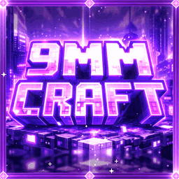

<h3 align="center">⚙️ Build it. 🔮 Cast it. ⚔️ Slay it. 🌻 Grow it. 🍲 Cook it. ⚡ Power it.</h3>

<i>Made with 💜 by xTri6</i>

